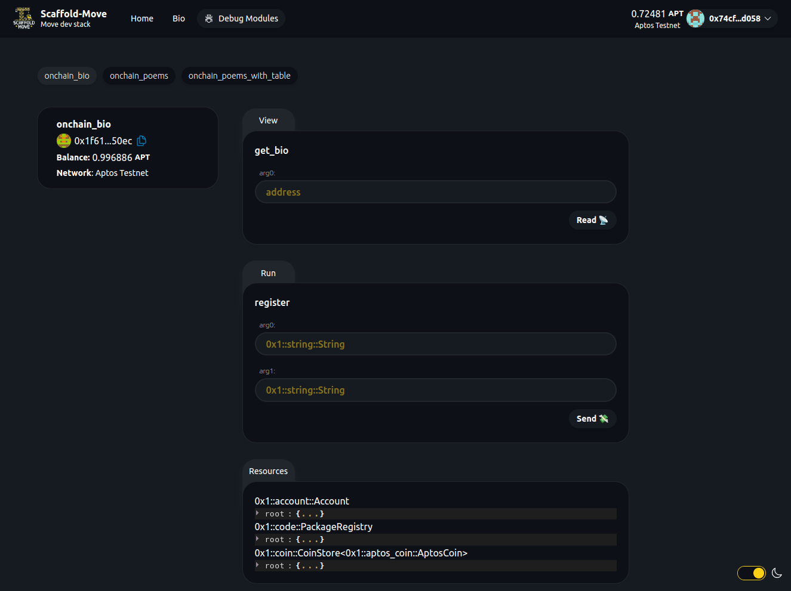

# 👋 Intro

🧪 Scaffold Move is an open-source, cutting-edge toolkit for building decentralized applications (dApps) on Aptos or any other Move-based blockchain. It's designed to streamline the process of creating and deploying Move modules and building user interfaces that interact seamlessly with those modules.

<table data-view="cards"><thead><tr><th></th><th></th><th></th><th data-hidden data-card-target data-type="content-ref"></th></tr></thead><tbody><tr><td></td><td>Quickstart</td><td></td><td><a href="intro/quickstart.md">quickstart.md</a></td></tr><tr><td></td><td>Links</td><td></td><td><a href="intro/links.md">links.md</a></td></tr></tbody></table>

⚙️ Built using Move, Aptos TS SDK, Next.js, Tailwind CSS, and TypeScript.

* 🛫 **Deployment Scripts**: Simplify and automate your deployment workflow.
* ✅ **Module Hot Reload**: Your frontend automatically adapts to changes in your Move modules as you edit them.
* 🪝 **Custom Hooks**: A collection of React hooks to simplify interactions with Move modules.
* 🧱 **Components**: A library of common Web3 components to rapidly build your frontend.
* 🔐 **Wallet Integration**: Connect to any Aptos-compatible wallet and interact with the Aptos network directly from your frontend.

Perfect for hackathons, prototyping, or launching your next Move project!

<figure><figcaption>
The Debug tab in Scaffold Move
</figcaption></figure>
