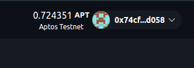

# Balance

Displays the balance of a given address in the native token (APT). 

## Screenshot


## Usage

```tsx
import { Balance } from "~~/components/scaffold-move";
import { useWallet } from "@aptos-labs/wallet-adapter-react";

const { account, connected } = useWallet();
<Balance address={account?.address as string} />
```

## Parameter
| Parameter                | Type     | Default Value | Description                                                                                                               |
| ------------------------ | -------- | ------------- | ------------------------------------------------------------------------------------------------------------------------- |
| **address**              | `string` | `undefined`   | Address in `0x___` format. |
| **className** (optional) | `string` | `""`          | Prop to pass additional CSS styling to the component, where you can use Tailwind / daisyUI classes for styling. |
